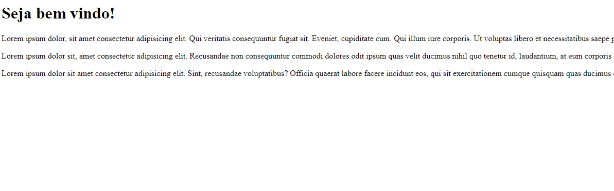
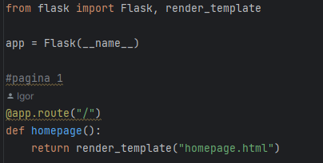
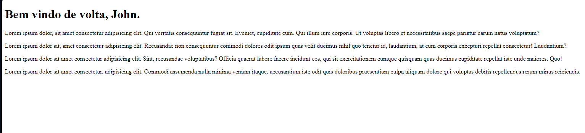
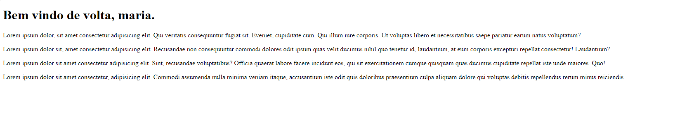
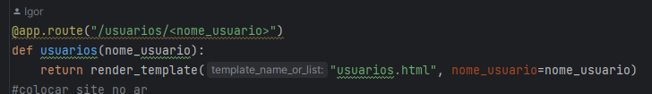
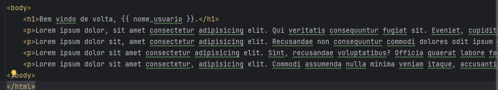

<h1 align="center" dir="auto">Website Test</h1>

 The main objective of this project is to show a model of website/social media using Python, HTML and CSS although there's
no CSS on the code

<h2>How does it works?</h2>

Although it is a simple project, it's a good demonstration
how python could work in websites instead of JavaScript.

There's three principal pages on this website:

- Homepage   - Contatos   - Usuario

<h2>Homepage</h2>

At the homepage the URL is formed by the principal website URL,
without thoses "/"  Exemple:

And the visual of the homepage depends on what each company wants to show
, sure, with some visual details made with CSS.

Exemple of home page:

And the code shows how we link Python with htlm and css using flask:

<h2> Adjacents pages </h2>
<h3>Contatos</h3>

This page was made just for exemple for the website, but it could be everything.

To access the page you need the "/" in the URL: 

<h3>Usuários</h3>

Made for exemple too, in case if the social media or the page register some peoples:

And an exemple with another name: 

And how it was made: 

